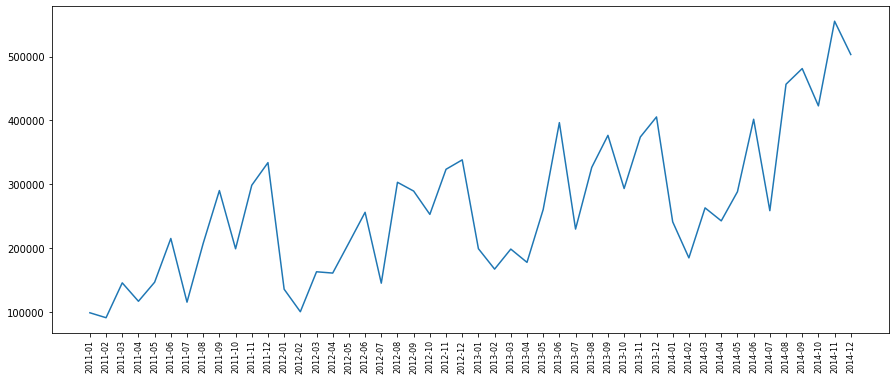
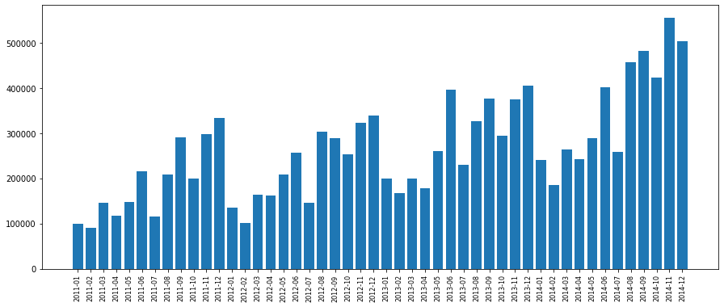
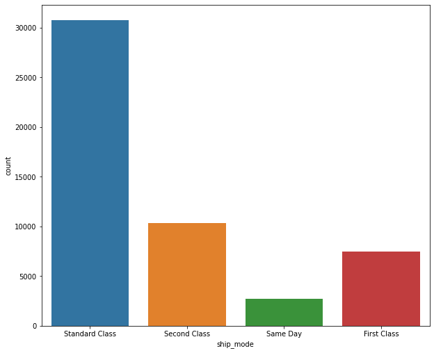

## GETTING KNOW ABOUT DATASET

#### IMPORT LIBRARIES


```python
import pandas as pd
import matplotlib.pyplot as plt
%matplotlib inline
import seaborn as sns
```

#### IMPORT DATASET


```python
dataset = "E:\My Works\My Career\Projects\Data Analysis\Sales DataSet Analysis\superstore_sales.xlsx"
sales = pd.read_excel(dataset)
```

#### DISPLAY DATASET FIRST ROWS


```python
sales.head()
```


<div>
<style scoped>
    .dataframe tbody tr th:only-of-type {
        vertical-align: middle;
    }

    .dataframe tbody tr th {
        vertical-align: top;
    }

    .dataframe thead th {
        text-align: right;
    }
</style>
<table border="1" class="dataframe">
  <thead>
    <tr style="text-align: right;">
      <th></th>
      <th>order_id</th>
      <th>order_date</th>
      <th>ship_date</th>
      <th>ship_mode</th>
      <th>customer_name</th>
      <th>segment</th>
      <th>state</th>
      <th>country</th>
      <th>market</th>
      <th>region</th>
      <th>...</th>
      <th>category</th>
      <th>sub_category</th>
      <th>product_name</th>
      <th>sales</th>
      <th>quantity</th>
      <th>discount</th>
      <th>profit</th>
      <th>shipping_cost</th>
      <th>order_priority</th>
      <th>year</th>
    </tr>
  </thead>
  <tbody>
    <tr>
      <th>0</th>
      <td>AG-2011-2040</td>
      <td>2011-01-01</td>
      <td>2011-01-06</td>
      <td>Standard Class</td>
      <td>Toby Braunhardt</td>
      <td>Consumer</td>
      <td>Constantine</td>
      <td>Algeria</td>
      <td>Africa</td>
      <td>Africa</td>
      <td>...</td>
      <td>Office Supplies</td>
      <td>Storage</td>
      <td>Tenex Lockers, Blue</td>
      <td>408.300</td>
      <td>2</td>
      <td>0.0</td>
      <td>106.140</td>
      <td>35.46</td>
      <td>Medium</td>
      <td>2011</td>
    </tr>
    <tr>
      <th>1</th>
      <td>IN-2011-47883</td>
      <td>2011-01-01</td>
      <td>2011-01-08</td>
      <td>Standard Class</td>
      <td>Joseph Holt</td>
      <td>Consumer</td>
      <td>New South Wales</td>
      <td>Australia</td>
      <td>APAC</td>
      <td>Oceania</td>
      <td>...</td>
      <td>Office Supplies</td>
      <td>Supplies</td>
      <td>Acme Trimmer, High Speed</td>
      <td>120.366</td>
      <td>3</td>
      <td>0.1</td>
      <td>36.036</td>
      <td>9.72</td>
      <td>Medium</td>
      <td>2011</td>
    </tr>
    <tr>
      <th>2</th>
      <td>HU-2011-1220</td>
      <td>2011-01-01</td>
      <td>2011-01-05</td>
      <td>Second Class</td>
      <td>Annie Thurman</td>
      <td>Consumer</td>
      <td>Budapest</td>
      <td>Hungary</td>
      <td>EMEA</td>
      <td>EMEA</td>
      <td>...</td>
      <td>Office Supplies</td>
      <td>Storage</td>
      <td>Tenex Box, Single Width</td>
      <td>66.120</td>
      <td>4</td>
      <td>0.0</td>
      <td>29.640</td>
      <td>8.17</td>
      <td>High</td>
      <td>2011</td>
    </tr>
    <tr>
      <th>3</th>
      <td>IT-2011-3647632</td>
      <td>2011-01-01</td>
      <td>2011-01-05</td>
      <td>Second Class</td>
      <td>Eugene Moren</td>
      <td>Home Office</td>
      <td>Stockholm</td>
      <td>Sweden</td>
      <td>EU</td>
      <td>North</td>
      <td>...</td>
      <td>Office Supplies</td>
      <td>Paper</td>
      <td>Enermax Note Cards, Premium</td>
      <td>44.865</td>
      <td>3</td>
      <td>0.5</td>
      <td>-26.055</td>
      <td>4.82</td>
      <td>High</td>
      <td>2011</td>
    </tr>
    <tr>
      <th>4</th>
      <td>IN-2011-47883</td>
      <td>2011-01-01</td>
      <td>2011-01-08</td>
      <td>Standard Class</td>
      <td>Joseph Holt</td>
      <td>Consumer</td>
      <td>New South Wales</td>
      <td>Australia</td>
      <td>APAC</td>
      <td>Oceania</td>
      <td>...</td>
      <td>Furniture</td>
      <td>Furnishings</td>
      <td>Eldon Light Bulb, Duo Pack</td>
      <td>113.670</td>
      <td>5</td>
      <td>0.1</td>
      <td>37.770</td>
      <td>4.70</td>
      <td>Medium</td>
      <td>2011</td>
    </tr>
  </tbody>
</table>
<p>5 rows × 21 columns</p>
</div>


#### DISPLAY DATASET LAST ROWS


```python
sales.tail()
```


<div>
<style scoped>
    .dataframe tbody tr th:only-of-type {
        vertical-align: middle;
    }

    .dataframe tbody tr th {
        vertical-align: top;
    }

    .dataframe thead th {
        text-align: right;
    }
</style>
<table border="1" class="dataframe">
  <thead>
    <tr style="text-align: right;">
      <th></th>
      <th>order_id</th>
      <th>order_date</th>
      <th>ship_date</th>
      <th>ship_mode</th>
      <th>customer_name</th>
      <th>segment</th>
      <th>state</th>
      <th>country</th>
      <th>market</th>
      <th>region</th>
      <th>...</th>
      <th>category</th>
      <th>sub_category</th>
      <th>product_name</th>
      <th>sales</th>
      <th>quantity</th>
      <th>discount</th>
      <th>profit</th>
      <th>shipping_cost</th>
      <th>order_priority</th>
      <th>year</th>
    </tr>
  </thead>
  <tbody>
    <tr>
      <th>51285</th>
      <td>CA-2014-115427</td>
      <td>2014-12-31</td>
      <td>2015-01-04</td>
      <td>Standard Class</td>
      <td>Erica Bern</td>
      <td>Corporate</td>
      <td>California</td>
      <td>United States</td>
      <td>US</td>
      <td>West</td>
      <td>...</td>
      <td>Office Supplies</td>
      <td>Binders</td>
      <td>Cardinal Slant-D Ring Binder, Heavy Gauge Vinyl</td>
      <td>13.904</td>
      <td>2</td>
      <td>0.2</td>
      <td>4.5188</td>
      <td>0.890</td>
      <td>Medium</td>
      <td>2014</td>
    </tr>
    <tr>
      <th>51286</th>
      <td>MO-2014-2560</td>
      <td>2014-12-31</td>
      <td>2015-01-05</td>
      <td>Standard Class</td>
      <td>Liz Preis</td>
      <td>Consumer</td>
      <td>Souss-Massa-Draâ</td>
      <td>Morocco</td>
      <td>Africa</td>
      <td>Africa</td>
      <td>...</td>
      <td>Office Supplies</td>
      <td>Binders</td>
      <td>Wilson Jones Hole Reinforcements, Clear</td>
      <td>3.990</td>
      <td>1</td>
      <td>0.0</td>
      <td>0.4200</td>
      <td>0.490</td>
      <td>Medium</td>
      <td>2014</td>
    </tr>
    <tr>
      <th>51287</th>
      <td>MX-2014-110527</td>
      <td>2014-12-31</td>
      <td>2015-01-02</td>
      <td>Second Class</td>
      <td>Charlotte Melton</td>
      <td>Consumer</td>
      <td>Managua</td>
      <td>Nicaragua</td>
      <td>LATAM</td>
      <td>Central</td>
      <td>...</td>
      <td>Office Supplies</td>
      <td>Labels</td>
      <td>Hon Color Coded Labels, 5000 Label Set</td>
      <td>26.400</td>
      <td>3</td>
      <td>0.0</td>
      <td>12.3600</td>
      <td>0.350</td>
      <td>Medium</td>
      <td>2014</td>
    </tr>
    <tr>
      <th>51288</th>
      <td>MX-2014-114783</td>
      <td>2014-12-31</td>
      <td>2015-01-06</td>
      <td>Standard Class</td>
      <td>Tamara Dahlen</td>
      <td>Consumer</td>
      <td>Chihuahua</td>
      <td>Mexico</td>
      <td>LATAM</td>
      <td>North</td>
      <td>...</td>
      <td>Office Supplies</td>
      <td>Labels</td>
      <td>Hon Legal Exhibit Labels, Alphabetical</td>
      <td>7.120</td>
      <td>1</td>
      <td>0.0</td>
      <td>0.5600</td>
      <td>0.199</td>
      <td>Medium</td>
      <td>2014</td>
    </tr>
    <tr>
      <th>51289</th>
      <td>CA-2014-156720</td>
      <td>2014-12-31</td>
      <td>2015-01-04</td>
      <td>Standard Class</td>
      <td>Jill Matthias</td>
      <td>Consumer</td>
      <td>Colorado</td>
      <td>United States</td>
      <td>US</td>
      <td>West</td>
      <td>...</td>
      <td>Office Supplies</td>
      <td>Fasteners</td>
      <td>Bagged Rubber Bands</td>
      <td>3.024</td>
      <td>3</td>
      <td>0.2</td>
      <td>-0.6048</td>
      <td>0.170</td>
      <td>Medium</td>
      <td>2014</td>
    </tr>
  </tbody>
</table>
<p>5 rows × 21 columns</p>
</div>


#### GETTING KNOW ABOUT DATSET SHAPE & COLUMNS


```python
sales.shape
```


    (51290, 21)


```python
for columns in sales.columns:
        print(columns)
```

    order_id
    order_date
    ship_date
    ship_mode
    customer_name
    segment
    state
    country
    market
    region
    product_id
    category
    sub_category
    product_name
    sales
    quantity
    discount
    profit
    shipping_cost
    order_priority
    year
    

#### GET INFORMATIONS ABOUT DATASET


```python
sales.info()
```

    <class 'pandas.core.frame.DataFrame'>
    RangeIndex: 51290 entries, 0 to 51289
    Data columns (total 21 columns):
     #   Column          Non-Null Count  Dtype         
    ---  ------          --------------  -----         
     0   order_id        51290 non-null  object        
     1   order_date      51290 non-null  datetime64[ns]
     2   ship_date       51290 non-null  datetime64[ns]
     3   ship_mode       51290 non-null  object        
     4   customer_name   51290 non-null  object        
     5   segment         51290 non-null  object        
     6   state           51290 non-null  object        
     7   country         51290 non-null  object        
     8   market          51290 non-null  object        
     9   region          51290 non-null  object        
     10  product_id      51290 non-null  object        
     11  category        51290 non-null  object        
     12  sub_category    51290 non-null  object        
     13  product_name    51290 non-null  object        
     14  sales           51290 non-null  float64       
     15  quantity        51290 non-null  int64         
     16  discount        51290 non-null  float64       
     17  profit          51290 non-null  float64       
     18  shipping_cost   51290 non-null  float64       
     19  order_priority  51290 non-null  object        
     20  year            51290 non-null  int64         
    dtypes: datetime64[ns](2), float64(4), int64(2), object(13)
    memory usage: 8.2+ MB
    

## DATA CLEANING

#### CHECK NULL VALUES


```python
sales.isnull().sum()
```


    order_id          0
    order_date        0
    ship_date         0
    ship_mode         0
    customer_name     0
    segment           0
    state             0
    country           0
    market            0
    region            0
    product_id        0
    category          0
    sub_category      0
    product_name      0
    sales             0
    quantity          0
    discount          0
    profit            0
    shipping_cost     0
    order_priority    0
    year              0
    dtype: int64


#### GET DESCRIPTIVE STATISTICS ABOUT DATASET


```python
sales.describe()
```


<div>
<style scoped>
    .dataframe tbody tr th:only-of-type {
        vertical-align: middle;
    }

    .dataframe tbody tr th {
        vertical-align: top;
    }

    .dataframe thead th {
        text-align: right;
    }
</style>
<table border="1" class="dataframe">
  <thead>
    <tr style="text-align: right;">
      <th></th>
      <th>sales</th>
      <th>quantity</th>
      <th>discount</th>
      <th>profit</th>
      <th>shipping_cost</th>
      <th>year</th>
    </tr>
  </thead>
  <tbody>
    <tr>
      <th>count</th>
      <td>51290.000000</td>
      <td>51290.000000</td>
      <td>51290.000000</td>
      <td>51290.000000</td>
      <td>51290.000000</td>
      <td>51290.000000</td>
    </tr>
    <tr>
      <th>mean</th>
      <td>246.490581</td>
      <td>3.476545</td>
      <td>0.142908</td>
      <td>28.641740</td>
      <td>26.375818</td>
      <td>2012.777208</td>
    </tr>
    <tr>
      <th>std</th>
      <td>487.565361</td>
      <td>2.278766</td>
      <td>0.212280</td>
      <td>174.424113</td>
      <td>57.296810</td>
      <td>1.098931</td>
    </tr>
    <tr>
      <th>min</th>
      <td>0.444000</td>
      <td>1.000000</td>
      <td>0.000000</td>
      <td>-6599.978000</td>
      <td>0.002000</td>
      <td>2011.000000</td>
    </tr>
    <tr>
      <th>25%</th>
      <td>30.758625</td>
      <td>2.000000</td>
      <td>0.000000</td>
      <td>0.000000</td>
      <td>2.610000</td>
      <td>2012.000000</td>
    </tr>
    <tr>
      <th>50%</th>
      <td>85.053000</td>
      <td>3.000000</td>
      <td>0.000000</td>
      <td>9.240000</td>
      <td>7.790000</td>
      <td>2013.000000</td>
    </tr>
    <tr>
      <th>75%</th>
      <td>251.053200</td>
      <td>5.000000</td>
      <td>0.200000</td>
      <td>36.810000</td>
      <td>24.450000</td>
      <td>2014.000000</td>
    </tr>
    <tr>
      <th>max</th>
      <td>22638.480000</td>
      <td>14.000000</td>
      <td>0.850000</td>
      <td>8399.976000</td>
      <td>933.570000</td>
      <td>2014.000000</td>
    </tr>
  </tbody>
</table>
</div>


```python
sales.info()
```

    <class 'pandas.core.frame.DataFrame'>
    RangeIndex: 51290 entries, 0 to 51289
    Data columns (total 21 columns):
     #   Column          Non-Null Count  Dtype         
    ---  ------          --------------  -----         
     0   order_id        51290 non-null  object        
     1   order_date      51290 non-null  datetime64[ns]
     2   ship_date       51290 non-null  datetime64[ns]
     3   ship_mode       51290 non-null  object        
     4   customer_name   51290 non-null  object        
     5   segment         51290 non-null  object        
     6   state           51290 non-null  object        
     7   country         51290 non-null  object        
     8   market          51290 non-null  object        
     9   region          51290 non-null  object        
     10  product_id      51290 non-null  object        
     11  category        51290 non-null  object        
     12  sub_category    51290 non-null  object        
     13  product_name    51290 non-null  object        
     14  sales           51290 non-null  float64       
     15  quantity        51290 non-null  int64         
     16  discount        51290 non-null  float64       
     17  profit          51290 non-null  float64       
     18  shipping_cost   51290 non-null  float64       
     19  order_priority  51290 non-null  object        
     20  year            51290 non-null  int64         
    dtypes: datetime64[ns](2), float64(4), int64(2), object(13)
    memory usage: 8.2+ MB
    

#### DERIVE YEAR AND MONTH FROM 'order_date' FOR FUTURE ANALYSIS


```python
sales['month_year'] = sales['order_date'].apply(lambda x: x.strftime('%Y-%m'))
```


```python
sales['month_year']
```


    0        2011-01
    1        2011-01
    2        2011-01
    3        2011-01
    4        2011-01
              ...   
    51285    2014-12
    51286    2014-12
    51287    2014-12
    51288    2014-12
    51289    2014-12
    Name: month_year, Length: 51290, dtype: object


## EXPLORATORY ANALYSIS

#### GROUP SALES BY MONTHS 


```python
sales_by_month = sales.groupby('month_year').sum()['sales'].reset_index()
```

#### VISALIZE SALES TRAND BY MONTHS


```python
plt.figure(figsize=(15,6))
plt.plot(sales_by_month['month_year'],sales_by_month['sales'])
plt.xticks(rotation='vertical',size=8)
plt.show()
```


    

    


```python
plt.figure(figsize=(15,6))
plt.bar(sales_by_month['month_year'],sales_by_month['sales'])
plt.xticks(rotation='vertical',size=8)
plt.show()
```


    

    


#### DISPLAY MOST SELLING PRODCUTS


```python
products_sales = pd.DataFrame(sales.groupby('product_name').sum()['sales'])
products_sales = products_sales.sort_values('sales',ascending=False)
```

#### TOP 10 MOST SALES PRODUCTS 


```python
products_sales[:10]
```


<div>
<style scoped>
    .dataframe tbody tr th:only-of-type {
        vertical-align: middle;
    }

    .dataframe tbody tr th {
        vertical-align: top;
    }

    .dataframe thead th {
        text-align: right;
    }
</style>
<table border="1" class="dataframe">
  <thead>
    <tr style="text-align: right;">
      <th></th>
      <th>sales</th>
    </tr>
    <tr>
      <th>product_name</th>
      <th></th>
    </tr>
  </thead>
  <tbody>
    <tr>
      <th>Apple Smart Phone, Full Size</th>
      <td>86935.7786</td>
    </tr>
    <tr>
      <th>Cisco Smart Phone, Full Size</th>
      <td>76441.5306</td>
    </tr>
    <tr>
      <th>Motorola Smart Phone, Full Size</th>
      <td>73156.3030</td>
    </tr>
    <tr>
      <th>Nokia Smart Phone, Full Size</th>
      <td>71904.5555</td>
    </tr>
    <tr>
      <th>Canon imageCLASS 2200 Advanced Copier</th>
      <td>61599.8240</td>
    </tr>
    <tr>
      <th>Hon Executive Leather Armchair, Adjustable</th>
      <td>58193.4841</td>
    </tr>
    <tr>
      <th>Office Star Executive Leather Armchair, Adjustable</th>
      <td>50661.6840</td>
    </tr>
    <tr>
      <th>Harbour Creations Executive Leather Armchair, Adjustable</th>
      <td>50121.5160</td>
    </tr>
    <tr>
      <th>Samsung Smart Phone, Cordless</th>
      <td>48653.4600</td>
    </tr>
    <tr>
      <th>Nokia Smart Phone, with Caller ID</th>
      <td>47877.7857</td>
    </tr>
  </tbody>
</table>
</div>


```python
products_by_quantity = pd.DataFrame(sales.groupby('product_name').sum()['quantity'])
products_by_quantity_sorted = products_by_quantity.sort_values('quantity',ascending=False)
```

#### TOP 10 MOST QUANTITY SELLING PRODUCTS ITEMS


```python
products_by_quantity_sorted[:10]
```


<div>
<style scoped>
    .dataframe tbody tr th:only-of-type {
        vertical-align: middle;
    }

    .dataframe tbody tr th {
        vertical-align: top;
    }

    .dataframe thead th {
        text-align: right;
    }
</style>
<table border="1" class="dataframe">
  <thead>
    <tr style="text-align: right;">
      <th></th>
      <th>quantity</th>
    </tr>
    <tr>
      <th>product_name</th>
      <th></th>
    </tr>
  </thead>
  <tbody>
    <tr>
      <th>Staples</th>
      <td>876</td>
    </tr>
    <tr>
      <th>Cardinal Index Tab, Clear</th>
      <td>337</td>
    </tr>
    <tr>
      <th>Eldon File Cart, Single Width</th>
      <td>321</td>
    </tr>
    <tr>
      <th>Rogers File Cart, Single Width</th>
      <td>262</td>
    </tr>
    <tr>
      <th>Sanford Pencil Sharpener, Water Color</th>
      <td>259</td>
    </tr>
    <tr>
      <th>Stockwell Paper Clips, Assorted Sizes</th>
      <td>253</td>
    </tr>
    <tr>
      <th>Avery Index Tab, Clear</th>
      <td>252</td>
    </tr>
    <tr>
      <th>Ibico Index Tab, Clear</th>
      <td>251</td>
    </tr>
    <tr>
      <th>Smead File Cart, Single Width</th>
      <td>250</td>
    </tr>
    <tr>
      <th>Stanley Pencil Sharpener, Water Color</th>
      <td>242</td>
    </tr>
  </tbody>
</table>
</div>


#### VISUALIZE MOST USED SHIP MODS


```python
plt.figure(figsize=(10,8.5))

sns.countplot(sales['ship_mode'])
plt.show()
```

    c:\users\sadaruwan\appdata\local\programs\python\python39\lib\site-packages\seaborn\_decorators.py:36: FutureWarning: Pass the following variable as a keyword arg: x. From version 0.12, the only valid positional argument will be `data`, and passing other arguments without an explicit keyword will result in an error or misinterpretation.
      warnings.warn(
    


    

    


#### MOST PROFITABLE PRODUCT CATEGORIES & SUB CATEGORIES


```python
cateory_by_profit = pd.DataFrame(sales.groupby(['category','sub_category']).sum()['profit'])
```


```python
cateory_by_profit.sort_values(['profit'],ascending=False)
```


<div>
<style scoped>
    .dataframe tbody tr th:only-of-type {
        vertical-align: middle;
    }

    .dataframe tbody tr th {
        vertical-align: top;
    }

    .dataframe thead th {
        text-align: right;
    }
</style>
<table border="1" class="dataframe">
  <thead>
    <tr style="text-align: right;">
      <th></th>
      <th></th>
      <th>profit</th>
    </tr>
    <tr>
      <th>category</th>
      <th>sub_category</th>
      <th></th>
    </tr>
  </thead>
  <tbody>
    <tr>
      <th rowspan="2" valign="top">Technology</th>
      <th>Copiers</th>
      <td>258567.54818</td>
    </tr>
    <tr>
      <th>Phones</th>
      <td>216717.00580</td>
    </tr>
    <tr>
      <th rowspan="2" valign="top">Furniture</th>
      <th>Bookcases</th>
      <td>161924.41950</td>
    </tr>
    <tr>
      <th>Chairs</th>
      <td>141973.79750</td>
    </tr>
    <tr>
      <th>Office Supplies</th>
      <th>Appliances</th>
      <td>141680.58940</td>
    </tr>
    <tr>
      <th>Technology</th>
      <th>Accessories</th>
      <td>129626.30620</td>
    </tr>
    <tr>
      <th rowspan="3" valign="top">Office Supplies</th>
      <th>Storage</th>
      <td>108461.48980</td>
    </tr>
    <tr>
      <th>Binders</th>
      <td>72449.84600</td>
    </tr>
    <tr>
      <th>Paper</th>
      <td>59207.68270</td>
    </tr>
    <tr>
      <th>Technology</th>
      <th>Machines</th>
      <td>58867.87300</td>
    </tr>
    <tr>
      <th>Office Supplies</th>
      <th>Art</th>
      <td>57953.91090</td>
    </tr>
    <tr>
      <th>Furniture</th>
      <th>Furnishings</th>
      <td>46967.42550</td>
    </tr>
    <tr>
      <th rowspan="4" valign="top">Office Supplies</th>
      <th>Envelopes</th>
      <td>29601.11630</td>
    </tr>
    <tr>
      <th>Supplies</th>
      <td>22583.26310</td>
    </tr>
    <tr>
      <th>Labels</th>
      <td>15010.51200</td>
    </tr>
    <tr>
      <th>Fasteners</th>
      <td>11525.42410</td>
    </tr>
    <tr>
      <th>Furniture</th>
      <th>Tables</th>
      <td>-64083.38870</td>
    </tr>
  </tbody>
</table>
</div>


